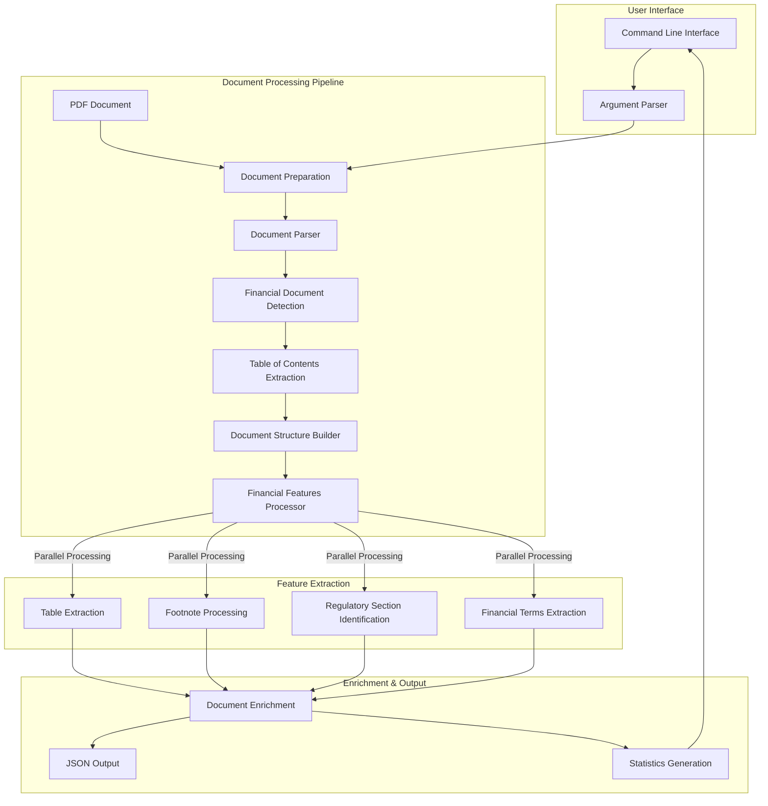
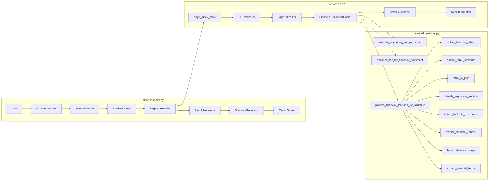
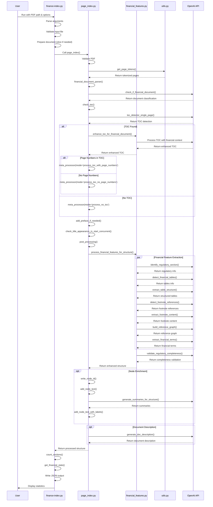
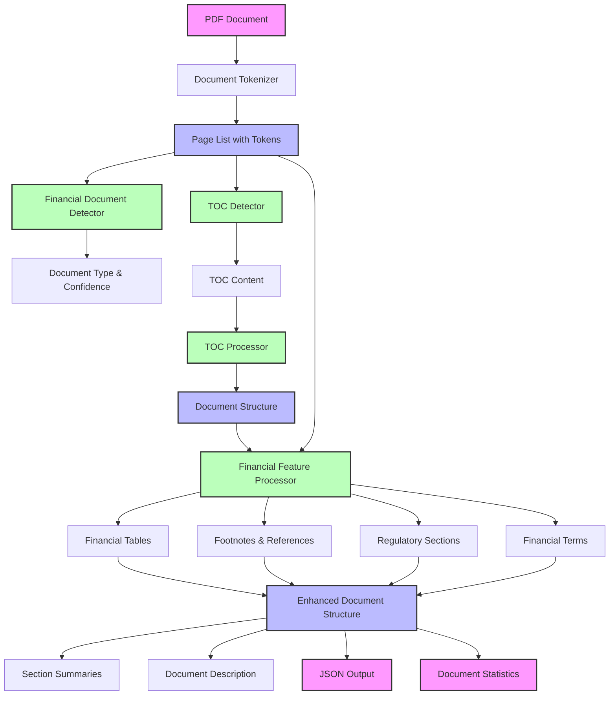
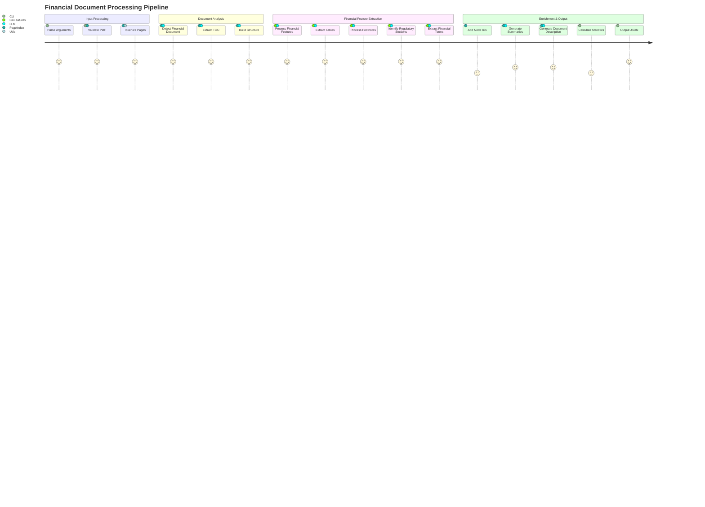

# finance-pageindex

A powerful system for processing and analyzing financial documents, with special focus on SEC 10-K filings. This tool extracts structured information from complex financial documents, identifies key sections, recognizes financial tables, extracts footnotes, and provides summaries of document content.

https://github.com/Cenrax/finance-pageindex

## Features

- **Document Structure Extraction**: Automatically detects and extracts the hierarchical structure of financial documents
- **Table of Contents Processing**: Identifies and processes TOC with or without page numbers
- **Financial Table Recognition**: Detects, extracts, and structures financial tables (balance sheets, income statements, etc.)
- **Regulatory Section Identification**: Recognizes standard regulatory sections in SEC filings
- **Footnote Processing**: Extracts footnotes and builds reference graphs connecting them to their mentions
- **Financial Term Extraction**: Identifies and defines financial terminology used in the document
- **Structure Verification**: Validates that extracted sections match the actual document content
- **Content Summarization**: Generates concise summaries of document sections

## Architecture Diagram

## High-Level Architecture Diagram (HLD)



## Mid-Level Component Diagram



## Low-Level Detailed Flow Diagram (LLD)



## Data Flow Diagram



## Component Interaction Matrix



## Key Components and Responsibilities

### 1. finance-index.py
- Command-line interface for the system
- Argument parsing and validation
- PDF document preparation
- Orchestration of the processing pipeline
- Statistics generation and output formatting

### 2. page_index.py
- Core document processing engine
- PDF validation and tokenization
- Financial document detection
- Table of contents extraction and processing
- Document structure building
- Node enrichment and metadata addition

### 3. financial_features.py
- Specialized financial feature extraction
- Financial table detection and structuring
- Regulatory section identification
- Footnote processing and reference linking
- Financial term extraction
- Regulatory completeness validation

### 4. utils.py
- Utility functions for the system
- PDF tokenization
- LLM API integration
- JSON processing
- Text processing utilities

## Processing Stages

1. **Input Processing**: Parse arguments, validate input file, prepare document
2. **Document Parsing**: Tokenize PDF into pages with token counts
3. **Financial Detection**: Determine if document is a financial SEC filing
4. **TOC Processing**: Extract and enhance table of contents
5. **Structure Building**: Create hierarchical document structure
6. **Financial Feature Extraction**: Process tables, footnotes, regulatory sections, and terms
7. **Enrichment**: Add IDs, summaries, and descriptions
8. **Output Generation**: Create JSON output and statistics

## Data Flow

The system processes data through these transformations:

1. PDF Document → Page List with Tokens
2. Page List → Document Type Classification
3. Page List → TOC Content
4. TOC Content → Document Structure
5. Document Structure + Page List → Enhanced Structure with Financial Features
6. Enhanced Structure → Final Output (JSON + Statistics)

## Installation

```bash
# Clone the repository
git clone https://github.com/Cenrax/finance-pageindex.git
cd finance-pageindex

# Install dependencies
pip install -r requirements.txt

# Set up environment variables
cp .env.example .env
# Edit .env with your OpenAI API key
```


### Advanced Configuration

You can configure the processing with additional parameters:

```python
result = page_index(
    "path/to/document.pdf",
    model="gpt-4o-",
    toc_check_page_num=20,
    max_page_num_each_node=50,
    max_token_num_each_node=100000,
    if_add_node_id="yes",
    if_add_node_summary="yes",
    if_add_doc_description="yes",
    if_add_node_text="yes",
    process_financial_features="yes",
    extract_tables="yes",
    extract_footnotes="yes"
)
```

## Architecture

The system is designed with a modular architecture:

1. **Core Processing**
   - Document ingestion and page tokenization
   - Structure extraction and verification
   - Financial feature detection

2. **Table of Contents (TOC) Processing**
   - TOC detection and extraction
   - Structure transformation with page mapping

3. **Financial Features**
   - Table detection and extraction
   - Regulatory section identification
   - Financial term extraction
   - Footnote processing

4. **Utilities**
   - PDF processing with PyPDF2/PyMuPDF
   - LLM integration with OpenAI's GPT models
   - Structure manipulation and validation

## Dependencies

- Python 3.8+
- OpenAI API access
- PyPDF2/PyMuPDF for PDF processing
- tiktoken for token counting
- asyncio for concurrent processing

## Contributing

Contributions are welcome! Please check the development checklist for areas that need improvement.

## License

[MIT License](LICENSE)

## Development Status Checklist

# finance-pageindex Development Checklist

## Core Document Analysis Functionality
- [x] Document structure extraction
- [x] Table of Contents (TOC) detection and processing
- [x] Financial table recognition and extraction
- [x] Regulatory section identification
- [x] Footnote and reference processing
- [x] Financial term extraction
- [x] Structure verification and correction
- [x] Section summarization

## 1. Financial Table Recognition and Extraction
- [x] Basic table detection
- [x] Simple table structure parsing
- [x] Numerical data extraction
- [x] Table-to-JSON conversion
- [ ] Neural network model for financial table detection
- [ ] PDF coordinate-based table boundary detection
- [ ] Multi-page table detection
- [ ] Advanced financial column type header recognition
- [ ] Currency and units of measurement detection
- [ ] Specialized extractors for financial figures
- [ ] Parentheses detection for negative values
- [ ] Financial table validation rules

## 2. Regulatory Section Identification
- [x] Basic section classification
- [x] Regulatory completeness validation
- [ ] Regulatory template database
- [ ] Financial document corpus classifier
- [ ] Neural text classification for ambiguous sections
- [ ] Fuzzy matching for section titles with variations
- [ ] Automatic suggestions for misclassified sections
- [ ] Compliance gap reporting
- [ ] Custom section handling
- [ ] Content-based classification for unlabeled sections
- [ ] Adaptive learning from previously processed documents

## 3. Footnote and Reference Linking
- [x] Reference marker detection
- [x] Footnote content extraction
- [x] Reference graph building
- [ ] Superscript and special character detection
- [ ] Reference continuity tracking
- [ ] Pattern recognition for various footnote styles
- [ ] Multi-page footnote section handling


## 4. Formula and Calculation Verification
- [ ] Mathematical expression parser
- [ ] Summation relationship detection in tables
- [ ] Calculation logic extraction from text
- [ ] Symbolic math engine for financial calculations
- [ ] Row and column sum validation
- [ ] Cross-reference checking between tables
- [ ] Rounding discrepancy detection
- [ ] Anomaly detection for numerical outliers
- [ ] Year-over-year variance analysis
- [ ] Calculation tracing and dependency visualization

## 5. Time-Series Data Extraction
- [ ] Temporal pattern recognition
- [ ] Date format and time period detection

## 6. Financial Terminology Recognition
- [x] Basic financial term extraction
- [ ] Comprehensive financial domain vocabulary
- [ ] Industry-specific terminology extensions
- [ ] Acronym and abbreviation expansion
- [ ] Specialized NER models for financial entities
- [ ] Detection for companies, securities, and financial instruments
- [ ] Domain-specific word embeddings for financial corpus
- [ ] Context-based disambiguation for overloaded terms
- [ ] Consistency validation for term usage

## 7. Materiality Assessment
- [ ] Quantitative materiality analysis
- [ ] Financial threshold implementation for materiality
- [ ] Percentage-based change detection
- [ ] Industry-specific materiality benchmarks
- [ ] Language analysis for material changes
- [ ] Sentiment analysis for risk disclosures
- [ ] Historical comparison with previous filings
- [ ] Tracking of key metrics over time
- [ ] Materiality summarization
- [ ] Prioritization of material disclosures

## 8. XBRL Integration
- [ ] XBRL instance document parsing
- [ ] Taxonomy handling for regulatory frameworks
- [ ] Mapping between XBRL tags and document content
- [ ] Extension taxonomy support
- [ ] Validation between PDF content and XBRL data
- [ ] Numerical consistency checking
- [ ] XBRL-enhanced semantic search
- [ ] Structured data generation


## 9. Document Intelligence Features
- [ ] Content similarity detection across documents
- [ ] Language pattern analysis for risk disclosure
- [ ] Forward-looking statement identification
- [ ] Management tone analysis
- [ ] Change detection in disclosure language
- [ ] Information density measurement
- [ ] Key message extraction
- [ ] Disclosure quality assessment
- [ ] Document complexity scoring
- [ ] Board communication analysis

## Document Processing Capabilities
- [x] PDF processing (PyPDF2/PyMuPDF)
- [ ] Complex document layout handling
- [ ] Multi-column text processing
- [ ] Table spanning multiple pages
- [ ] Chart and graph recognition
- [ ] Embedded image extraction and analysis
- [ ] Document segmentation for parallel processing
- [ ] Incremental document processing
- [ ] Document type classification (10-K, 10-Q, etc.)
- [ ] Handling of nested document structures


